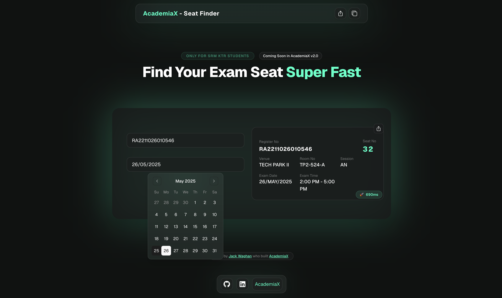

# 🎓 AcademiaX SRM Exam Seat Finder

A modern, lightning-fast seat finder for SRM KTR students.  
Built with [Next.js](https://nextjs.org), [shadcn/ui](https://ui.shadcn.com/), and a beautiful custom dark theme.

<p align="center">
  
</p>

---

## 🚀 Features

- **Super Fast**: Instantly find your SRM exam seat by registration number and date.
- **Modern UI**: Responsive, glassmorphic design with dark mode by default.
- **Share & Copy**: Share your seat details or copy them with a single click.
- **Mobile Friendly**: Fully responsive.
- **Built by [Jack Waghan](https://jackwaghan.in)**, creator of [AcademiaX](https://academiax.in).

---

## 🖥️ Getting Started

1. **Clone the repository:**

   ```bash
   git clone https://github.com/jackwaghan/srm-exam-seat-finder.git
   cd srm-exam-seat-finder
   ```

2. **Install dependencies:**

   ```bash
   bun install
   ```

3. **Run the development server:**

   ```bash
   bun run dev
   ```

4. **Open your browser:**  
   Visit [http://localhost:3000](http://localhost:3000) to use the app.

---

## 🛠️ Tech Stack

- **Framework:** [Next.js 14+](https://nextjs.org/)
- **UI:** [shadcn/ui](https://ui.shadcn.com/) + [Tailwind CSS](https://tailwindcss.com/)
- **Icons:** [react-icons](https://react-icons.github.io/react-icons/)
- **Font:** [Geist](https://vercel.com/font)
- **Web Scraping:** [cheerio](https://cheerio.js.org/) (server-side)

---

## ✨ Usage

1. Enter your **SRM Registration Number**.
2. Pick your **Exam Date** using the modern date picker.
3. Click **Find Seat**.
4. View, share, or copy your seat details.

---

## 📦 Deploy

Deploy instantly on [Vercel](https://vercel.com/new?utm_source=github&utm_medium=readme&utm_campaign=srm-exam-seat-finder)  
or any platform that supports Next.js.

---

## 🤝 Credits

- **Built by [Jack Waghan](https://jackwaghan.in)**
- Inspired by the needs of SRM KTR students.
- Part of the [AcademiaX](https://academiax.in) ecosystem.

---

## 📄 License

Apache License 2.0.  
See [LICENSE](./LICENSE) for details.

---

> Made with ❤️ for SRM KTR students.
